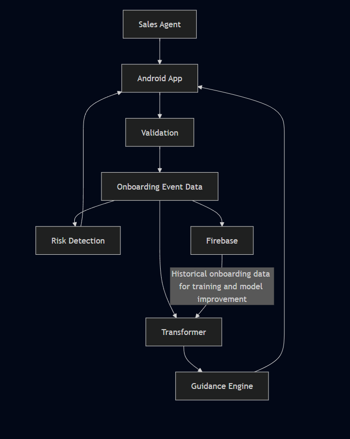

# System Architecture

## Purpose

The system architecture defines how the Android app, validation, onboarding event data, Transformer, guidance engine, risk detection, and Firebase work together to support consistent onboarding execution.

## System Components

### Android App

The Android app is used by the sales agent to perform customer onboarding. It displays onboarding fields and provides guidance about the next onboarding field.

### Validation

Validation checks the information entered by the sales agent and identifies invalid or incorrect values.

### Onboarding Event Data

The system records onboarding events during each onboarding session.

Each event includes:

- Industry
- Session ID
- Field
- Action
- Time spent
- Error status
- Whether the field was revisited
- Completion status

The sequence of these events represents what has happened during the current onboarding session.

### Transformer

The Transformer receives the previous sequence of onboarding events and predicts the next onboarding field.

### Guidance Engine

The guidance engine uses the Transformer's prediction and the current onboarding state to provide guidance to the sales agent through the Android app.

### Risk Detection

Risk detection monitors onboarding events for unusual or risky patterns and sends detected risks to the Android app so that the sales agent can see the relevant warning.

### Firebase

Firebase stores onboarding session and event data. Historical onboarding data stored in Firebase can be used for Transformer training and model improvement.

## Data Flow

1. The sales agent performs customer onboarding through the Android app.
2. The information entered by the sales agent is checked by validation.
3. Onboarding events are recorded during the session.
4. The previous sequence of onboarding events is provided to the Transformer.
5. The Transformer predicts the next onboarding field.
6. The guidance engine uses the Transformer's prediction and the current onboarding state to provide guidance through the Android app.
7. Risk detection monitors the onboarding events for unusual or risky patterns and sends detected risks to the Android app.
8. Firebase stores the onboarding session and event data for later analysis, Transformer training, and model improvement.

## Architecture Diagram

